## Zomato Clone App with DevSecOps CI/CD

Deploying a React Js Zomato-clone Application. We will be using `Jenkins` as a CICD tool and deploying our application on a `Docker container` and push it in a `Docker-Hub`. I Hope this detailed readme file will be useful.

---

### DevSecOps  CICD Project flow :

  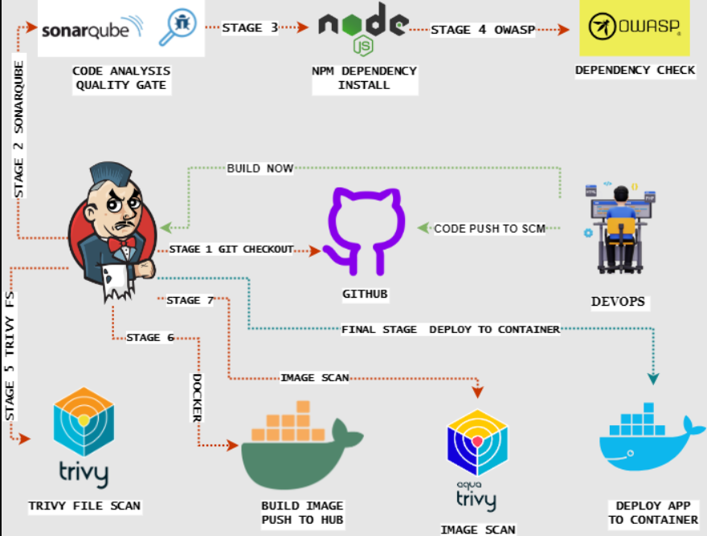

  [FOR DETAILED BLOG CLICK HERE](https://mrcloudbook.com/zomato-clone-app-with-devsecops-ci-cd/)
  

---

**prerequisites**

  - Account of Aws/azure clud
  - Jenkins Installed
  - Account on Dockerhub
  - Docker installed
  - Install Nodejs nd npn on Jenkins

---

 ## **Step 1. Launch an Ubuntu 22.04 EC2 Instance with size `t2.large`machine** 
   1. You can attached an Elastic Ip address so that if you stopped your machine you can get an same ip address but look into an cost optimization in aws or azure .
   2. Here I am using an Aws cloud.

   3. I have attched an Elastic-ip to my instance.

## ***steps for elastic ip***

### 🔹 **Step 1: Allocate an Elastic IP**
1. Sign in to the **AWS Management Console**.
2. Navigate to **EC2 Dashboard**.
3. In the left panel, click **Elastic IPs** under **Network & Security**.
4. Click **Allocate Elastic IP address**.
5. Select **Amazon’s pool of IPv4 addresses** and click **Allocate**.
6. Copy the allocated **Elastic IP** for later use.

### 🔹 **Step 2: Associate the Elastic IP with an EC2 Instance**
1. Go to **Elastic IPs** in the EC2 Dashboard.
2. Select the allocated IP and click **Actions > Associate Elastic IP address**.
3. In the **Instance field**, select the EC2 instance to associate the IP with.
4. Choose the **private IP address** (if multiple exist).
5. Click **Associate**.

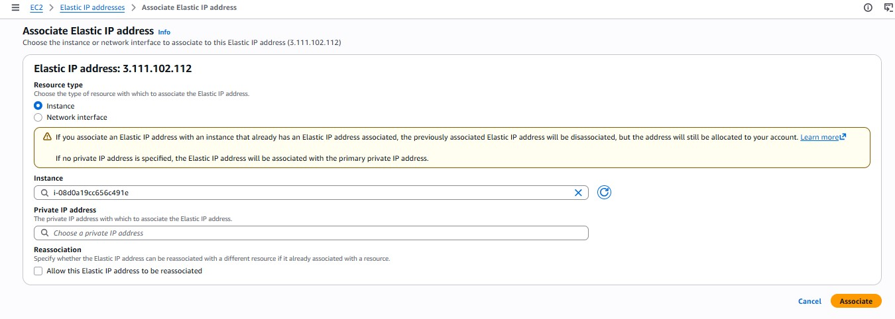

 ✅ **Your EC2 instance is now associated with the Elastic IP.**  
   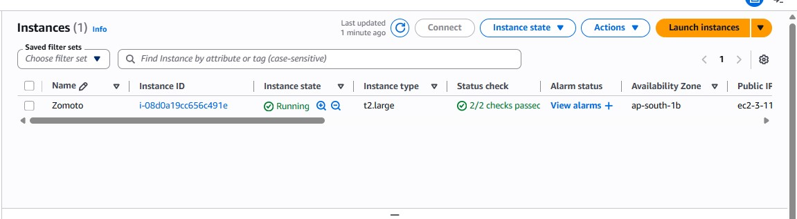 

Now logged in into the machine via `SSH`.

---
## Step 2. Install Jenkins Docker Sonarqube and Trivy

 ### Installing Jenkins 
 1. Install Jdk-17 on your machine for jenkins
    ```bash
    sudo apt update && sudo apt install -y openjdk-17-jdk

    ```
 2. To Install Jenkins in linux Go to [Long Term support](https://www.jenkins.io/doc/book/installing/linux/#debianubuntu)

 3. Once Jenkins is installed, you will need to go to your Web Browser and type your public-ip address along with port 8080, since Jenkins works on Port 8080.
 
 4. Now, grab your Public IP Address
```bash
   EC2 Public IP Address:8080
   sudo cat /var/lib/jenkins/secrets/initialAdminPassword
```
 5. Jenkins is instelld Succefully,and You will see the follwing page

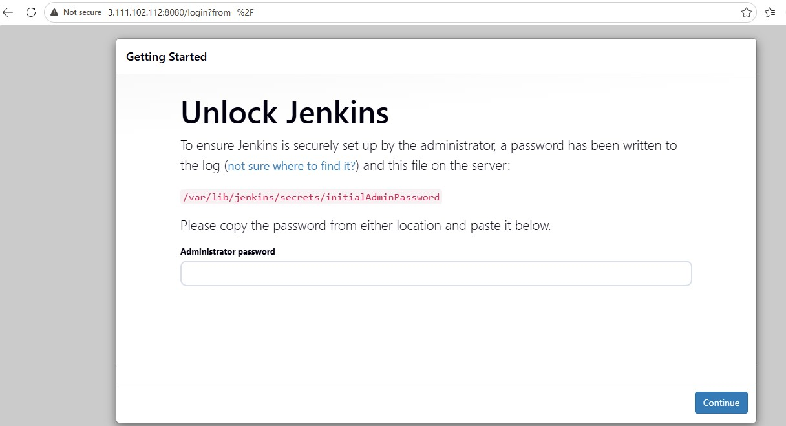

 6. Unlock Jenkins using an administrative password and install the suggested plugins.
  `sudo cat /var/lib/jenkins/secrets/initialAdminPassword`

 7. Jenkins will now get installed and install all the libraries.

 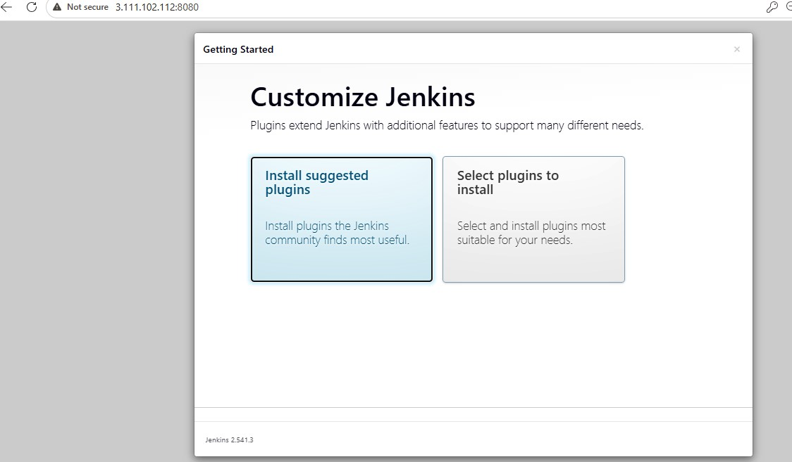

 8. Create a user click on save and continue.

 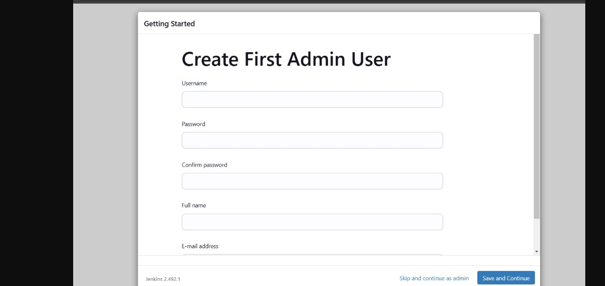

 9. Jenkins Getting Started Screen.

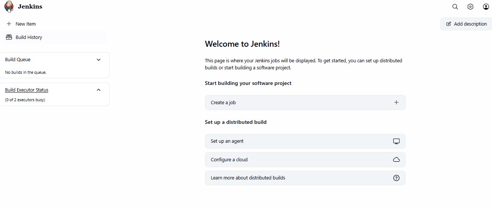

### Installing Docker 
```bash
sudo apt-get update
sudo apt-get install docker.io -y
sudo usermod -aG docker $USER
newgrp docker
sudo chmod 777 /var/run/docker.sock
```
#### After the docker installation, we create a sonarqube container (Remember to add 9000 ports in the security group).

```sh
docker run -d --name sonar -p 9000:9000 sonarqube:lts-community
```
1. Now our sonarqube is up and Running. 

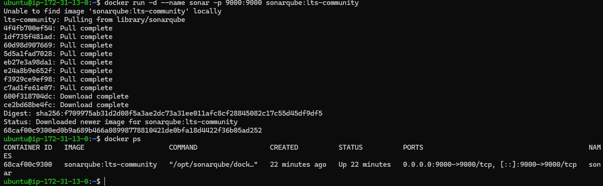

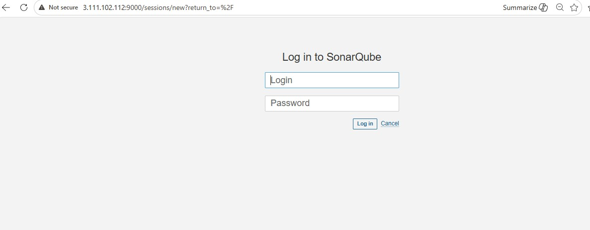

2. Enter username and password, click on login and change password
 ```bash
 username admin
 password admin
 ```
 
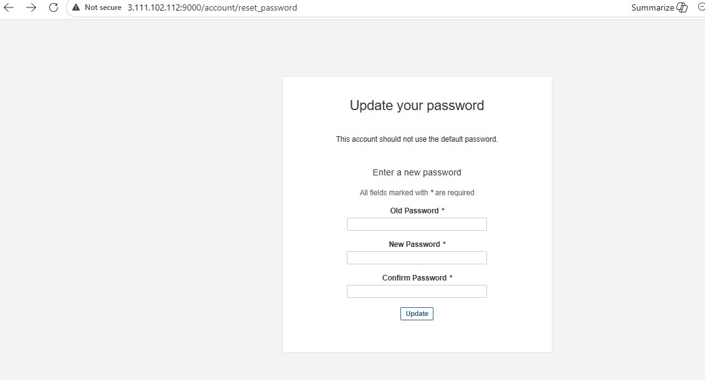

3. Update New password, This is Sonar Dashboard.

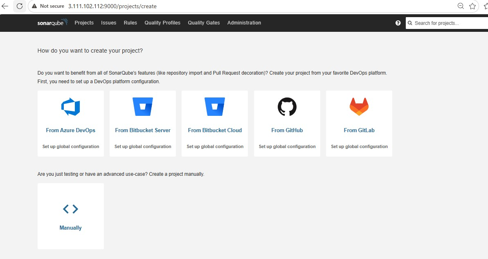


### Installing trivy

```bash
vi trivy.sh
```

```bash
sudo apt-get install wget apt-transport-https gnupg lsb-release -y
wget -qO - https://aquasecurity.github.io/trivy-repo/deb/public.key | gpg --dearmor | sudo tee /usr/share/keyrings/trivy.gpg > /dev/null
echo "deb [signed-by=/usr/share/keyrings/trivy.gpg] https://aquasecurity.github.io/trivy-repo/deb $(lsb_release -sc) main" | sudo tee -a /etc/apt/sources.list.d/trivy.list
sudo apt-get update
sudo apt-get install trivy -y
```
Run above script using `sh trivy.sh`


Next, we will log in to Jenkins and start to configure our Pipeline in Jenkins

---

## Step 3 : Install Plugins like JDK, Sonarqube Scanner, NodeJs, OWASP Dependency Check

## 🛠 3A — Install Plugin  

## 📌 Steps to Install Plugins in Jenkins  

1. Navigate to **Manage Jenkins** → **Plugins** → **Available Plugins**  
2. Install the following plugins **without restart**:  

   - **Eclipse Temurin Installer**  
   - **SonarQube Scanner**  
   - **NodeJs Plugin**  

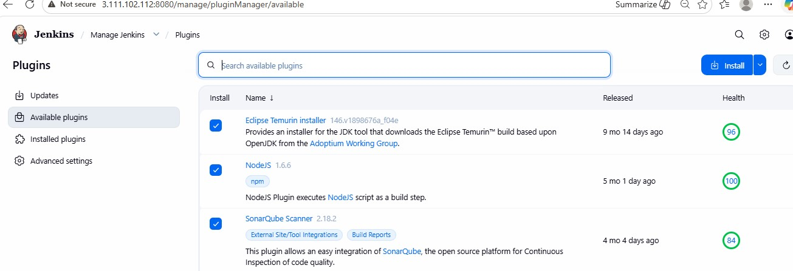


## 🛠 3B — Configure Java and Node.js in Global Tool Configuration  

### 📌 Steps to Configure Java (JDK 17) and Node.js (16)  

1. Navigate to **Manage Jenkins** → **Global Tool Configuration**  
2. Scroll down to **JDK** and **NodeJS** sections  
3. Configure the tools as follows:  
   - **JDK:** Install **JDK 17**  
   - **Node.js:** Install **Node.js 16**  
4. Click **Apply** and then **Save**  

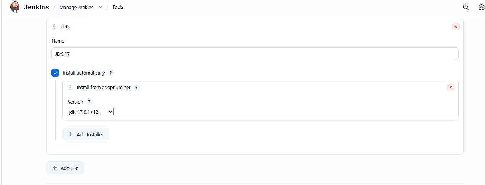

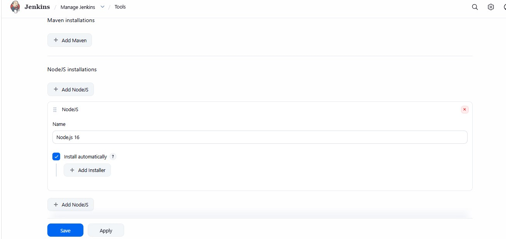

## 🛠 3C — Create a Job in Jenkins  

## 📌 Steps to Create a Pipeline Job  

1. Navigate to **Jenkins Dashboard**  
2. Click on **New Item**  
3. Enter the job name as **Zomato**  
4. Select **Pipeline** as the job type  
5. Click **OK**  
6. Configure the pipeline as needed  
7. Click **Apply** and then **Save**  

✅ The Jenkins pipeline job **Zomato** is now created. 

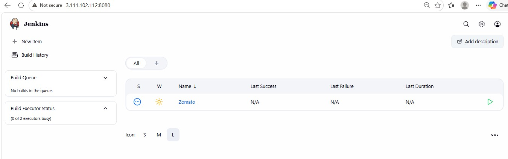

## 🛠 Step 4 — Configure Sonar Server in Manage Jenkins  

## 📌 Steps to Configure SonarQube Server  

1. **Get the Public IP Address** of your EC2 instance  
2. SonarQube runs on **Port 9000**, so access it using: 
 `http:<public-ip>:9000`

3. **Login to SonarQube Server**  
4. Navigate to:  
- **Administration** → **Security** → **Users**

 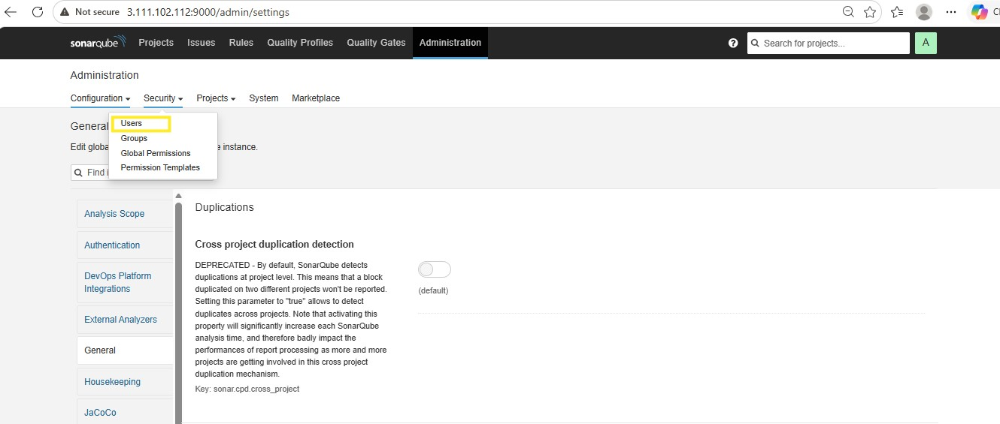  

- Click on **Tokens**  
5. Click on **Update Token**  

 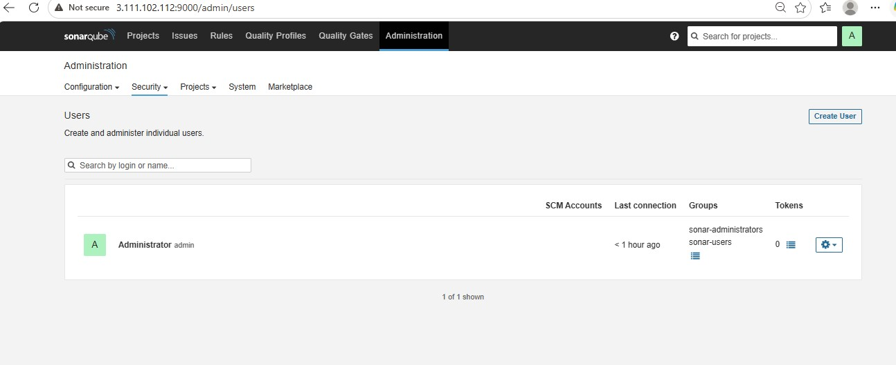

6. **Give it a name** and click on **Generate Token** 

7. Copy and store the token securely for Jenkins integration  

8. Goto Jenkins Dashboard → Manage Jenkins → Credentials → Add Secret Text.

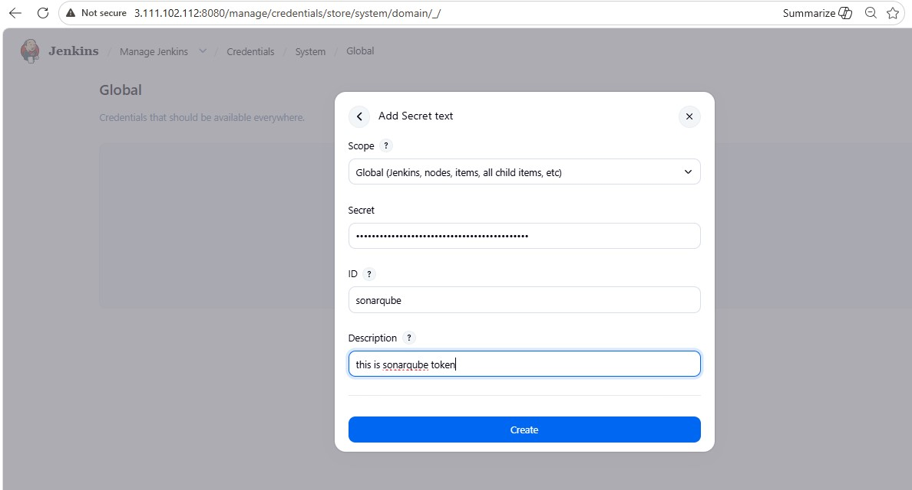

9. You will this page once you click on create

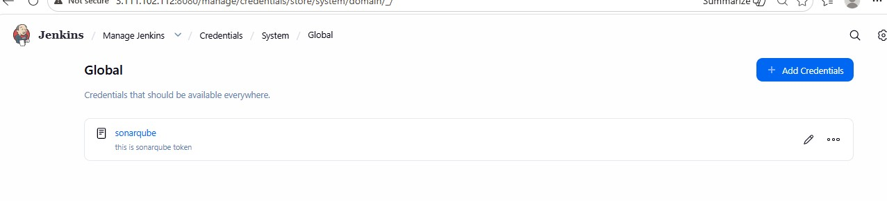

10. Now, go to Dashboard → Manage Jenkins → System and Add like the below image.

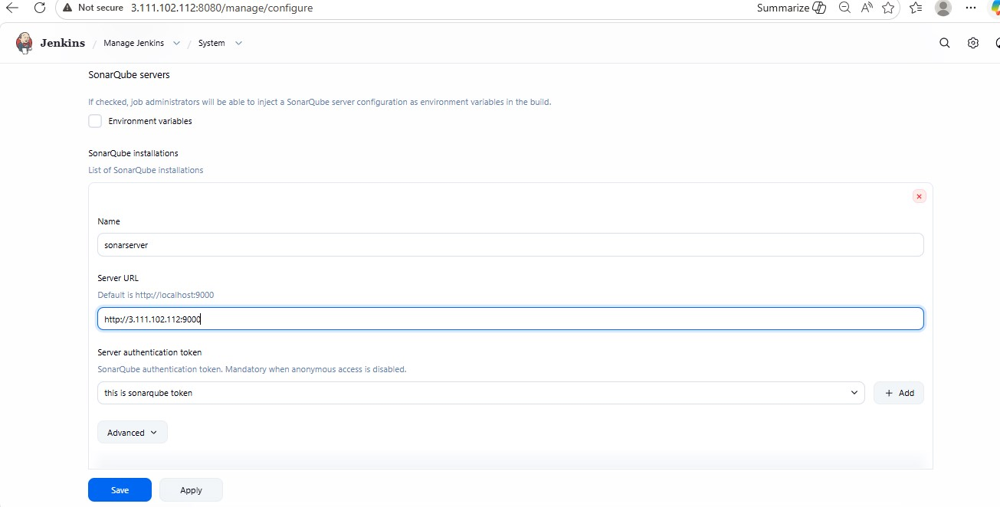

The Configure System option is used in Jenkins to configure different server

Global Tool Configuration is used to configure different tools that we install using Plugins

We will install a sonar scanner in the tools.
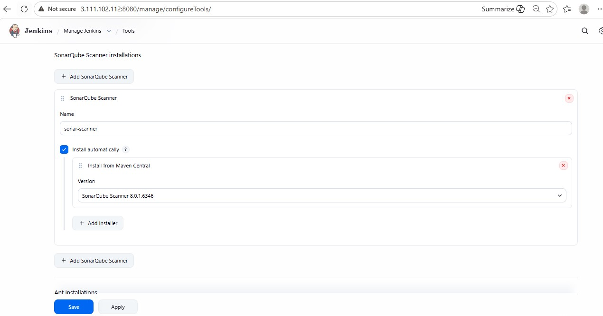

In the Sonarqube Dashboard add a quality gate also

Add details
```sh 
#in url section of quality gate
http://jenkins-public-ip:8080/sonarqube-webhook/
```
Administration–> Configuration–>Webhooks
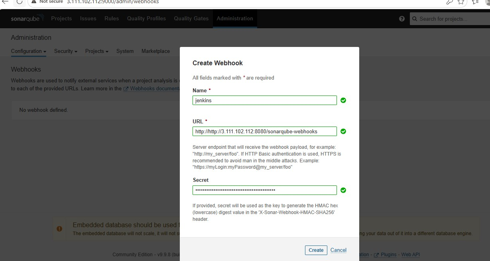

Let’s go to our Pipeline and add the script in our Pipeline Script
```bash

pipeline{
    agent any
    
    tools{
        jdk 'JDK 17'  // Ensure this matches the JDK name in Jenkins Global Tool Configuration
        nodejs 'Node.js 16'  // Ensure Node.js is installed in Jenkins
    }

    environment {
        NVD_API_KEY = credentials('NVD_API_KEY')  // Fetch API key securely
        SCANNER_HOME=tool 'sonar-scanner'
    }

    stages {

        stage('clean workspace'){
            steps{
                cleanWs()
            }
        }

        stage('Checkout from Git'){
            steps{
                git branch: 'main', url: 'https://github.com/venkeyboda07/Zomato-Clone-DevSecOps-Jenkins.git'
            }
        }

        stage("Sonarqube Analysis "){
            steps{
                 withSonarQubeEnv('sonarserver') {  // Replace 'sonar-server' with the actual name from Jenkins config
                    sh '''
                        $SCANNER_HOME/bin/sonar-scanner \
                        -Dsonar.projectName=zomato \
                        -Dsonar.projectKey=zomato \
                        -Dsonar.host.url=http://3.111.102.112:9000 \
                        -Dsonar.login=ssqu_966c6423ee1c24cb3c95fe7a445d3406c2f97494
                    '''
                }
            }
        }

        stage("quality gate"){
           steps {
                script {
                    waitForQualityGate abortPipeline: false, credentialsId: 'Sonar-token'
                }
            }
        }

        stage('Install Dependencies') {
            steps {
                sh "npm install"
            }
        }
```
Click on Build now, you will see the stage view like this
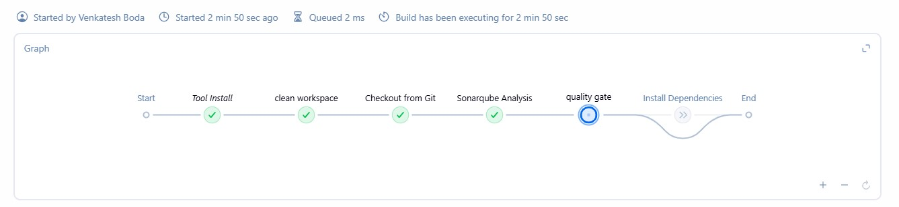

To see the report, you can go to Sonarqube Server and go to Projects.

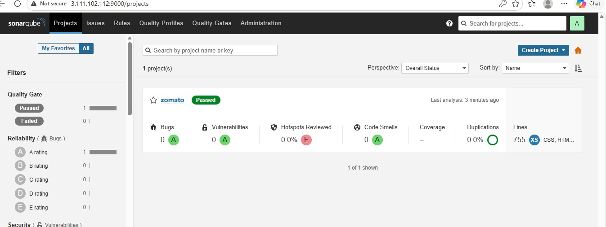

You can see the report has been generated and the status shows as passed. You can see that there are 1.3k lines. To see a detailed report, you can go to issues.

### Step 5 — Install OWASP Dependency Check Plugins
GotoDashboard → Manage Jenkins → Plugins → OWASP Dependency-Check. Click on it and install it without restart.

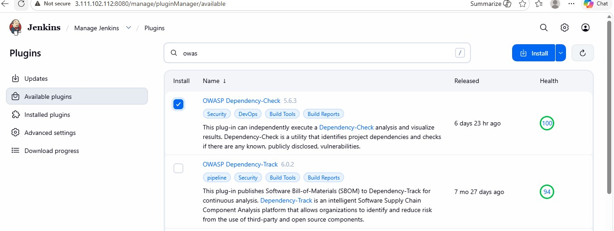

First, we configured the Plugin and next, we had to configure the Tool

Goto Dashboard → Manage Jenkins → Tools →

Click on Apply and Save here.
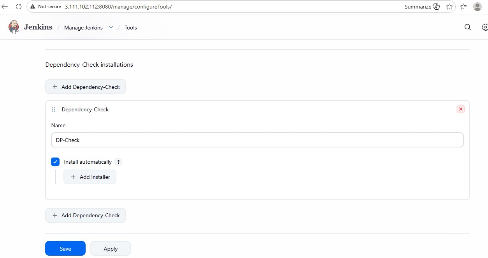

Now go configure → Pipeline and add this stage to your pipeline and build.

```bash

        stage('OWASP FS SCAN') {
                    steps {
                        dependencyCheck additionalArguments: '--scan ./ --disableYarnAudit --disableNodeAudit', odcInstallation: 'DP-Check'
                        dependencyCheckPublisher pattern: '**/dependency-check-report.xml'
                    }
        }

        stage('TRIVY FS SCAN') {
            steps {
                sh "trivy fs . > trivyfs.txt"
            }
        }
```

The stage view would look like this,
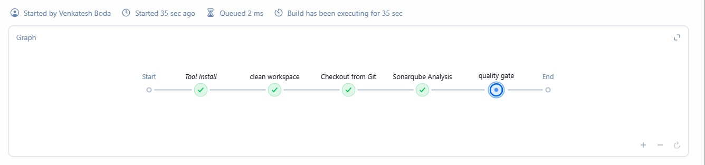

You will see that in status, a graph will also be generated and Vulnerabilities.
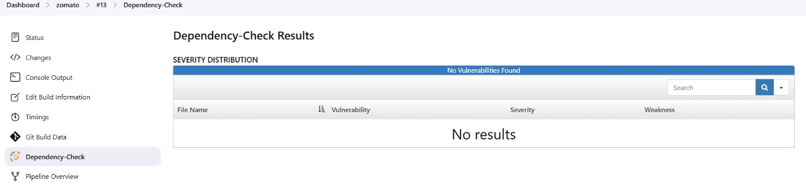


## Step 6 — Docker Image Build and Push

1. We need to install the Docker tool in our system, Goto Dashboard → Manage Plugins → Available plugins → Search for Docker and install these plugins

1. **Docker**

2. **Docker Commons**

3. **Docker Pipeline**

4. **Docker API**

5. **docker-build-step**

and click on install without restart
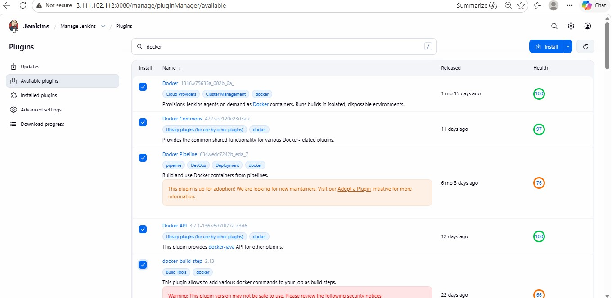

2. Now, goto Dashboard → Manage Jenkins → Tools →

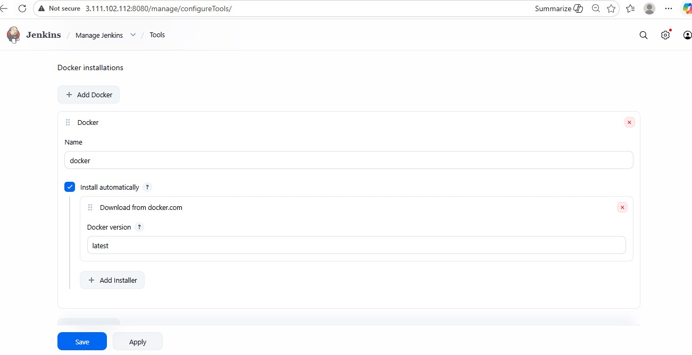

3. Add DockerHub Username and Password under Global Credentials
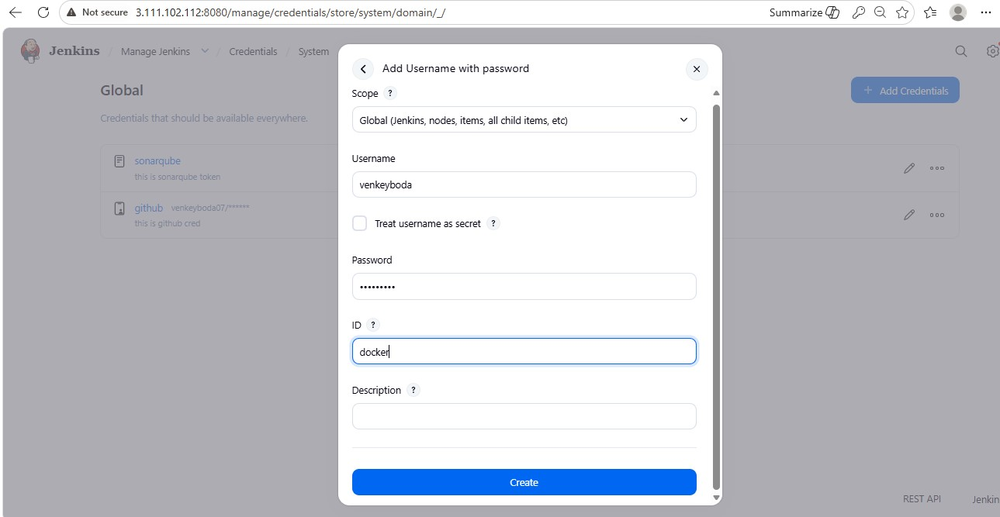

4. Add this stage to Pipeline Script
 ```bash

        stage("Docker Build & Push"){
                steps{
                    script{
                        withDockerRegistry(credentialsId: 'docker', toolName: 'docker'){
                            sh "docker build -t zomato ."
                            sh "docker tag zomato venkeyboda/zomato:1.0"
                            sh "docker push venkeyboda/zomato:1.0"
                        }
                    }
                }
            }

        stage("TRIVY"){
            steps{
                sh "trivy image  venkeyboda/zomato:1.0> trivy .txt"
            }
        }
```
4. You will see the output below, with a dependency trend. 

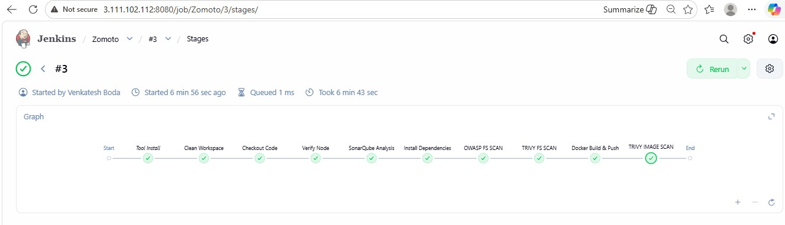

5. When you log in to Dockerhub, you will see a new image is created

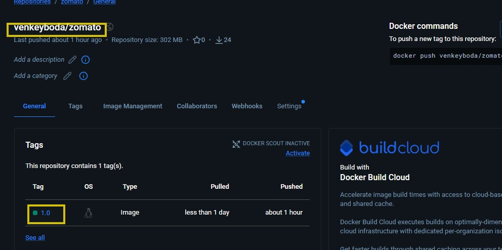

6. Now Run the container to see if the app coming up or not by adding the below stage
```bash
stage('Deploy to container'){
     steps{
            sh 'docker run -d --name zomato -p 3000:3000 venkeyboda/zomato:1.0'
          }
      }
```
7. Youll see the stage view in pipeline 
  Go to Jenkins Dashboard → Click on your Pipeline job → Navigate to the Stage View section on the job’s main page.

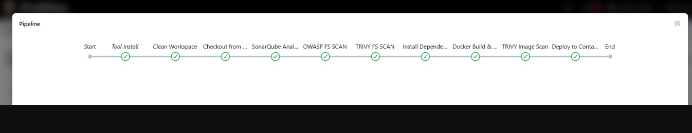

8. To See the output type on the browser as below 
   `http:<pubic-ipa>:3000` Youll be directed to 

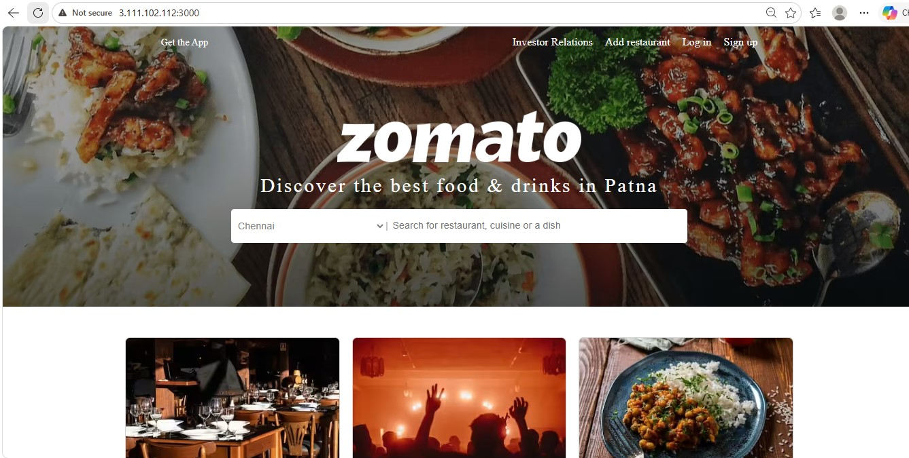

## Step 8: Terminate instances.

Complete Pipeline [Jenkinsfile](/Jenkinsfile)


**Conclusion**
- Implementing DevSecOps in this project successfully integrated security, development, and operations, ensuring a secure, automated, and efficient CI (continous Integration) pipeline. By leveraging Jenkins, Docker, Kubernetes, AWS, and security tools like Snyk and OWASP ZAP, we enhanced code security, automated vulnerability scanning, and streamlined deployments. This approach reduced security risks, improved compliance, and accelerated software delivery while maintaining high reliability. The project highlights the importance of shifting security left, fostering a collaborative culture between DevOps and security teams to build resilient and secure applications


I Hope Youll find the project useful, Happy Learning!! 😃

